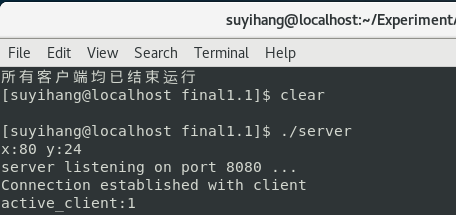

# Linux-AirplainWarGame

## 项目介绍

该程序实现了一个飞机大战的小游戏，支持一人或多人联机进行游戏。游戏通过击落敌人飞机以获得对应的分数，每个角色可以通过 ***w a s d*** 按键来控制飞机的方向，通过***空格键***实现发射子弹。敌机会从屏幕上方随机生成并逐渐下落，玩家击落敌机则可获得分数，如果玩家的飞机与敌机碰撞，则游戏结束。

## 实验环境

操作系统：Centos7.5

编译器：gcc (std=c99)

需要额外添加的库： pthread  、 ncurses

项目编译：确保环境正确，直接运行compile.sh即可

## 项目演示

#### 视频演示：

[飞机大战小游戏演示-bilibili](https://www.bilibili.com/video/BV17arzYSEs4/?share_source=copy_web&vd_source=b309e11d64b0a36144423f3f5f551c7c)

#### 图片演示：

1.启动服务端：

说明：启动客户端，并默认连接到8080端口

2.启动客户端并连接到服务端：

说明:蓝色为玩家1的飞机，黄色为敌方飞机，绿色为发射的子弹，右上角为玩家的分数

3.加入其他玩家：

说明：总共加入的四个玩家，分别由各自的终端所控制

3.同步刷新：

说明：可以看到，加入游戏的四个玩家所显示的界面相同

4.击杀敌人分数更新：

说明：玩家2成功击杀4名敌人，分数更新

5.被击杀效果显示：

说明：玩家2被敌机撞毁，显示GameOver以及当前的游戏分数，玩家1客户端不再显示玩家2角色

1. **架构视图**

1)客户端服务端连接视图：

2)服务端流程图：

3)客户端流程图：

